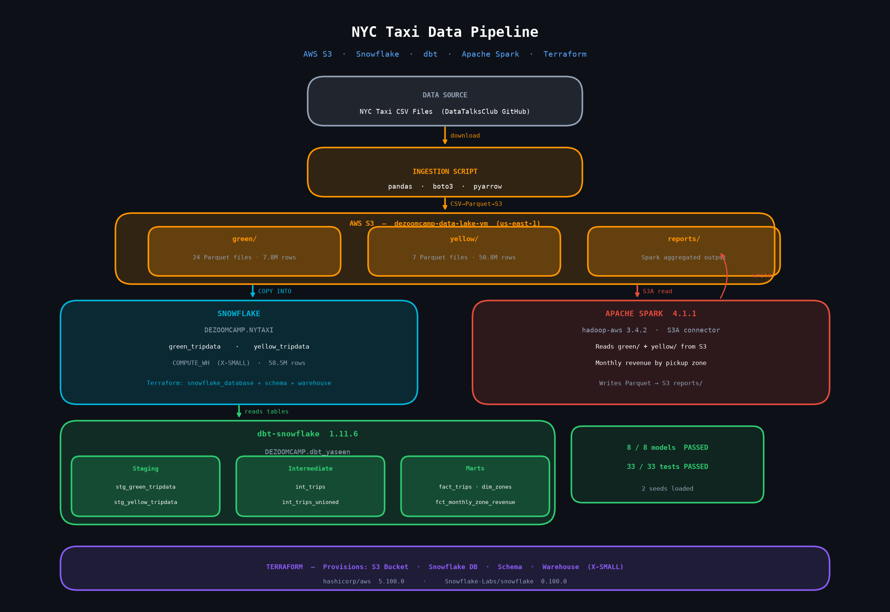

# NYC Taxi Data Pipeline — AWS + Snowflake

End-to-end data engineering pipeline for NYC Yellow & Green taxi trip data using modern cloud tools.

> **Stack:** AWS S3 · Snowflake · dbt · Apache Spark · Terraform · Python

---

## Architecture



---

## What This Project Does

1. **Ingestion** — Downloads NYC taxi CSV files, converts to Parquet, uploads to AWS S3
2. **Warehousing** — Loads Parquet from S3 into Snowflake via COPY INTO (58.5M rows)
3. **Transformation** — dbt models clean, join, and aggregate the data in Snowflake
4. **Batch Processing** — Spark reads from S3, computes monthly revenue by zone, writes results back to S3

---

## Project Structure

```
nyc-taxi-pipeline-terraform-dbt-spark/
├── terraform/              # Infrastructure as Code — S3 + Snowflake
│   ├── main.tf
│   └── variables.tf
├── dbt/                    # Analytics engineering
│   ├── models/             # 8 models (staging → intermediate → marts)
│   ├── macros/
│   ├── seeds/              # taxi_zone_lookup, payment_type_lookup
│   └── dbt_project.yml
├── spark/                  # Batch processing
│   └── 06_spark_sql_s3.py  # S3A revenue aggregation job
├── scripts/                # Data ingestion
│   ├── load_to_s3.py       # CSV → Parquet → S3
│   └── setup_snowflake.py  # S3 → Snowflake COPY INTO
└── docs/
    ├── architecture.png    # Visual architecture diagram
    ├── architecture.md     # Detailed architecture notes
    └── setup_guide.md      # Step-by-step setup instructions
```

---

## Results

| Component | Result |
|-----------|--------|
| S3 Parquet files | 31 files |
| Snowflake rows loaded | 58,547,656 |
| dbt models | 8 / 8 ✅ |
| dbt tests | 33 / 33 ✅ |
| Spark job | S3 read → aggregate → S3 write ✅ |

---

## Tech Stack

| Layer | Technology |
|-------|-----------|
| Cloud Storage | AWS S3 (`us-east-1`) |
| Data Warehouse | Snowflake |
| Infrastructure | Terraform |
| Transformation | dbt-snowflake |
| Batch Processing | Apache Spark 4.1.1 + hadoop-aws |
| Language | Python 3.12 |

---

## Quick Start

```bash
# 1. Provision infrastructure
cd terraform && terraform init && terraform apply

# 2. Load data to S3 + Snowflake
python scripts/load_to_s3.py
python scripts/setup_snowflake.py

# 3. Run dbt models
cd dbt && dbt deps && dbt seed && dbt run && dbt test

# 4. Run Spark job
spark-submit --packages org.apache.hadoop:hadoop-aws:3.4.2,com.amazonaws:aws-java-sdk-bundle:1.12.787 \
  spark/06_spark_sql_s3.py \
  --input_green=s3a://your-bucket/green/ \
  --input_yellow=s3a://your-bucket/yellow/ \
  --output=s3a://your-bucket/reports/revenue
```

See [docs/setup_guide.md](docs/setup_guide.md) for full setup instructions.

---

## Security

- No credentials hardcoded anywhere in the codebase
- AWS credentials: `~/.aws/credentials` (AWS CLI)
- Snowflake password: local file outside repo
- dbt profiles: `~/.dbt/profiles.yml` outside repo
- Terraform state: gitignored
